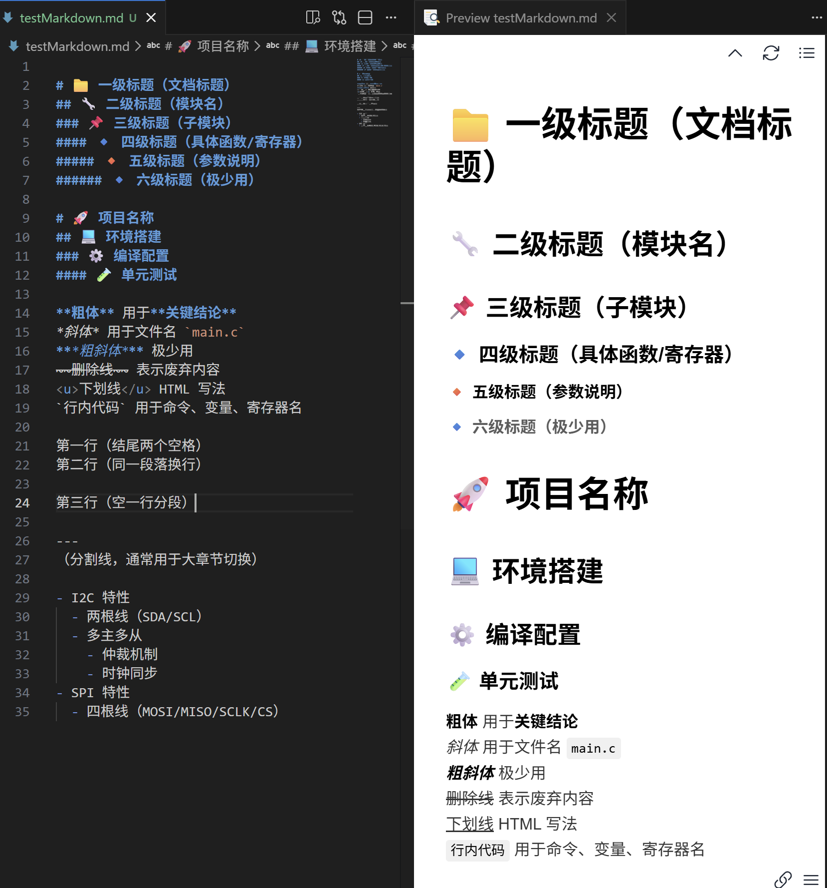

# 📁 一、标题 —— 笔记的骨架
# 📁 一级标题（文档标题）
## 🔧 二级标题（模块名）
### 📌 三级标题（子模块）
#### 🔹 四级标题（具体函数/寄存器）
##### 🔸 五级标题（参数说明）
###### 🔹 六级标题（极少用）

# 🚀 项目名称
## 💻 环境搭建
### ⚙️ 编译配置
#### 🧪 单元测试

# 二、段落与文本样式
**粗体** 用于**关键结论**  
*斜体* 用于文件名 `main.c`  
***粗斜体*** 极少用  
~~删除线~~ 表示废弃内容  
<u>下划线</u> HTML 写法  
`行内代码` 用于命令、变量、寄存器名

第一行（结尾两个空格）  
第二行（同一段落换行）

第三行（空一行分段）

---
（分割线，通常用于大章节切换）

# 三、列表 —— 流程与清单
🔹 3.1 无序列表
- I2C 特性
  - 两根线（SDA/SCL）
  - 多主多从
    - 仲裁机制
    - 时钟同步
- SPI 特性
  - 四根线（MOSI/MISO/SCLK/CS）
🔹 3.2 有序列表
1. 配置 GPIO 为复用功能
2. 设置 I2C 时钟频率
   1. 100kHz（标准模式）
   2. 400kHz（快速模式）
3. 使能外设

# 四、引用与提示框

🗣️ 4.1 基础引用
> 这是普通引用块，通常用于摘录文档。

⚠️ 4.2 技术笔记专用提示（结合 Emoji）
> 💡 **技巧**：使用 `-1` 返回值表示错误，而非 `0`。

> ⚠️ **警告**：操作 CR1 寄存器前必须等待 BUSY 位清零。

> ❌ **常见错误**：忘记使能外设时钟。

> ✅ **最佳实践**：中断服务函数中尽量少做处理，仅置标志位。

# 五、代码块 —— 技术笔记的灵魂

🧩 5.1 基础代码块（必须标注语言）
```c
#include <stdio.h>
int main() {
    printf("Hello, embedded world!\n");
    return 0;
}
```
```cpp
class LidarDriver {
public:
    LidarDriver();
    ~LidarDriver();
    bool init(uint32_t baudrate);
private:
    int fd_;
};
```
```bash
#!/bin/bash
# 交叉编译脚本
export CROSS_COMPILE=arm-linux-gnueabihf-
${CROSS_COMPILE}gcc -o hello hello.c
```
```python
import serial
ser = serial.Serial('/dev/ttyUSB0', 115200)
ser.write(b'AT\r\n')
```

```json
{
  "name": "hesai_lidar",
  "version": "2.0.0",
  "dependencies": {
    "pcap": "^1.0.0"
  }
}
```
🖼️ 6.2 图片（本地与网络）
markdown



# 📊 七、表格 —— 参数/寄存器/对比
## 🧮 7.1 基础表格
| 寄存器 | 地址偏移 | 复位值 | 描述         |
|--------|----------|--------|--------------|
| CR1    | 0x00     | 0x0000 | 控制寄存器1  |
| SR     | 0x1C     | 0x0000 | 状态寄存器   |
| DR     | 0x10     | 0x0000 | 数据寄存器   |
效果：整齐对齐，表头自动加粗。

## 📈 7.2 对齐与特殊内容
| 左对齐 | 居中对齐 | 右对齐 |
|:-------|:-------:|-------:|
| 100kHz | I2C     |   模式 |
| 400kHz | I2C     |   快速 |


# 📊 八 其他用到的再学把